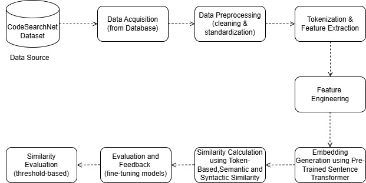

# AI-Driven-Code-Plagiarism-and-Similarity-Detection
AI-driven system for detecting code plagiarism and assessing similarity. Analyzes source code to generate detailed reports with percentage-based similarity metrics, supporting originality and duplication detection for developers, academic institutions, and organizations

## Overview
The **Code Similarity Checker** is a system designed to evaluate the similarity of a reference code with other codes in a dataset. The system uses a combination of token-based, semantic, and syntactic similarity techniques to calculate the similarity percentage. This tool is particularly useful for identifying code plagiarism, analyzing code structure, and assessing the reuse of code snippets in software development.

---

## Business Objective
The primary business objective of this project is to provide organizations, academic institutions, and developers with a robust tool to ensure code originality and maintain intellectual property integrity. By automating the process of similarity detection, the system reduces manual effort, mitigates risks of plagiarism, and enhances code quality and compliance in software development practices.

---

## Features
- **Data Preprocessing:** Cleans and standardizes code to ensure uniformity.
- **Feature Extraction:** Uses tokenization and advanced feature engineering.
- **Similarity Calculation:** Employs token-based, semantic, and syntactic similarity methods.
- **Embedding Generation:** Utilizes pre-trained sentence transformers for generating embeddings.
- **Threshold-based Evaluation:** Determines similarity scores based on a predefined threshold.
- **Feedback and Fine-tuning:** Includes an iterative process for model optimization.

---

## Dataset
The project leverages the **CodeSearchNet Dataset**, which provides a rich collection of code snippets in multiple programming languages. This dataset serves as the foundation for training and evaluating the system.

---

## System Architecture
Below is the architecture diagram illustrating the system's workflow:

1. **Data Source:** CodeSearchNet Dataset.
2. **Data Acquisition:** Fetches data from the database.
3. **Data Preprocessing:** Involves cleaning and standardizing code.
4. **Tokenization & Feature Extraction:** Breaks down code into tokens and extracts relevant features.
5. **Feature Engineering:** Enhances the dataset with meaningful attributes.
6. **Embedding Generation:** Uses pre-trained sentence transformers for embedding generation.
7. **Similarity Calculation:** Combines token-based, semantic, and syntactic similarity measures.
8. **Evaluation and Feedback:** Fine-tunes models based on iterative feedback.
9. **Similarity Evaluation:** Applies threshold-based scoring to determine similarity.

---

## Implementation Steps
1. **Data Collection:** Load and acquire the CodeSearchNet dataset.
2. **Data Cleaning:** Standardize and clean code snippets to remove noise.
3. **Feature Engineering:** Tokenize the code and extract relevant features.
4. **Embedding Generation:** Use pre-trained models like Sentence-BERT for embedding generation.
5. **Similarity Calculation:** Compute similarity scores using token-based, semantic, and syntactic methods.
6. **Evaluation:** Assess results against a threshold and fine-tune the model based on feedback.

---

## Tools and Technologies
- **Programming Languages:** Python
- **Libraries:**
  - Transformers (Hugging Face)
  - NLTK
  - Scikit-learn
  - NumPy, Pandas
- **Frameworks:** TensorFlow, PyTorch
- **Dataset:** CodeSearchNet

---

## Applications
- **Plagiarism Detection:** Identify duplicate or plagiarized code snippets.
- **Code Quality Analysis:** Evaluate the reuse of code for quality assurance.
- **Software Development:** Analyze codebases for similarity and structure.

---

## Future Enhancements
- Expand support for more programming languages.
- Integrate visualization tools for similarity scores.
- Improve semantic similarity techniques using advanced models.

